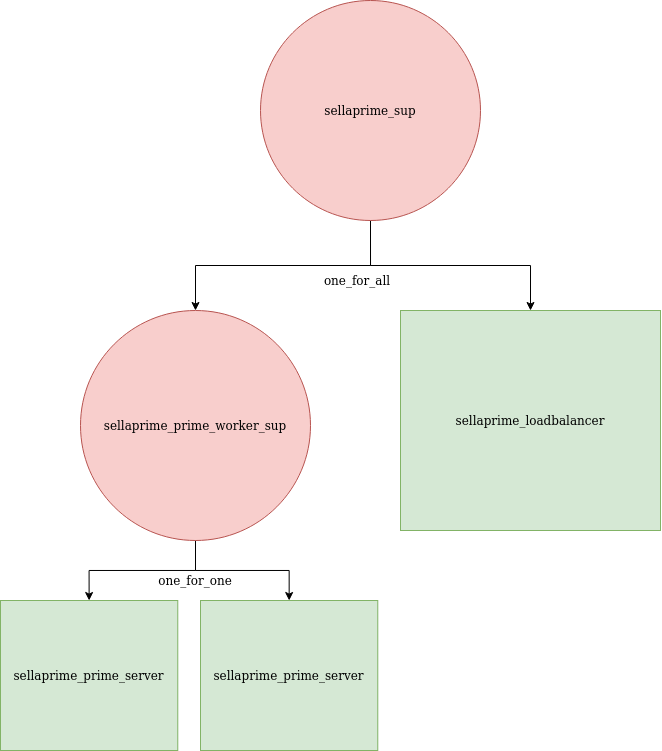

sellaprime
=====

The OTP application exercise application from Chapter 23 [Programming Erlang](https://www.amazon.de/Programming-Erlang-Concurrent-Pragmatic-Programmers/dp/193778553X#ace-g5242129131).

---
# Supervision Tree

---
# Run

`$ rebar3 shell --sname local --setcookie ABC`

Start the observer on a different node:
`$ erl -sname observer -hidden -setcookie ABC -run observer`

---
# Use

`(local@archbox)1> sellaprime_loadbalancer:is_prime(237823).`

Kill stuff using the `observer` and watch how the supervision strategies behave.